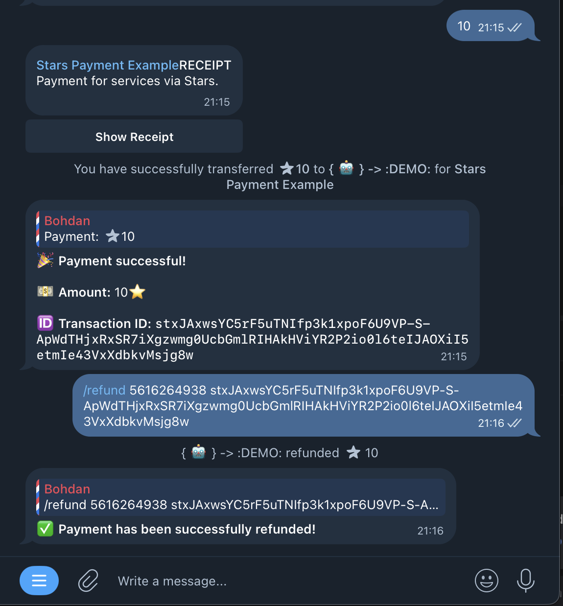

<div align="center">
   

   <h1 style="margin-top: 24px; font-size:42px;">Telegram Stars Payment Bot</h1>

   <p style="font-size:18px; color:#555; max-width:640px; line-height:1.4;">
      <strong>Reference integration for Telegram Stars payments: invoices, refunds, paid media, and balance checks.</strong>
   </p>

   <p>
      <a href="https://github.com/bohd4nx/stars-payment/issues">Report Bug</a>
      ·
      <a href="https://github.com/bohd4nx/stars-payment/issues">Request Feature</a>
      ·
      <a href="https://t.me/bohd4nx">Contact Author</a>
   </p>
</div>

---

## Features

- Example of Stars payment flow using `/pay <amount>`
- Optional payment link flow (commented in `payment.py`)
- Refund a specific payment with `/refund <user_id> <transaction_id>`
- Check bot balance with `/balance`
- Send paid media with `/paid_media <amount>`
- Batch refund user transactions with `/refund_user <user_id>`

## Screenshot / Example

<div align="center">
   
</div>

## Quick Start

### 1. Clone & Install

```bash
git clone https://github.com/bohd4nx/stars-payment.git
cd stars-payment
pip install -r requirements.txt
```

### 2. Configuration

Create `.env` from `.env.example` and set:

```env
BOT_TOKEN=your_bot_token_here
```

### 3. Run

```bash
python main.py
```

## Commands

| Command                              | Description                             |
|--------------------------------------|-----------------------------------------|
| `/start`                             | Show integration overview               |
| `/pay <amount>`                      | Create a Stars invoice                  |
| `/refund <user_id> <transaction_id>` | Refund a specific Stars payment         |
| `/balance`                           | Show current Stars balance              |
| `/paid_media <amount>`               | Send paid media with Stars price        |
| `/refund_user <user_id>`             | Refund all refundable user transactions |

---

<div align="center" style="margin-top:32px;">
   <p><strong>Made with ❤️ by <a href="https://t.me/bohd4nx" target="_blank">@bohd4nx</a></strong></p>
   <p>Star ⭐ this repo if it helps your Telegram payments!</p>
</div>
